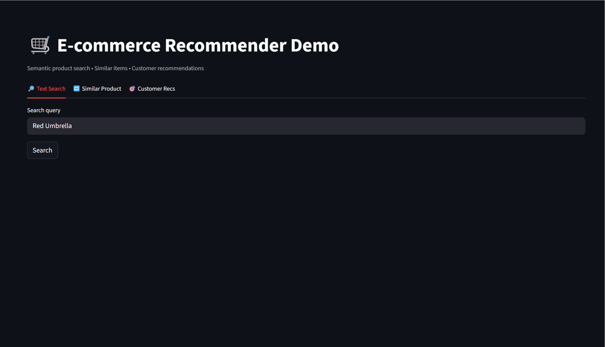
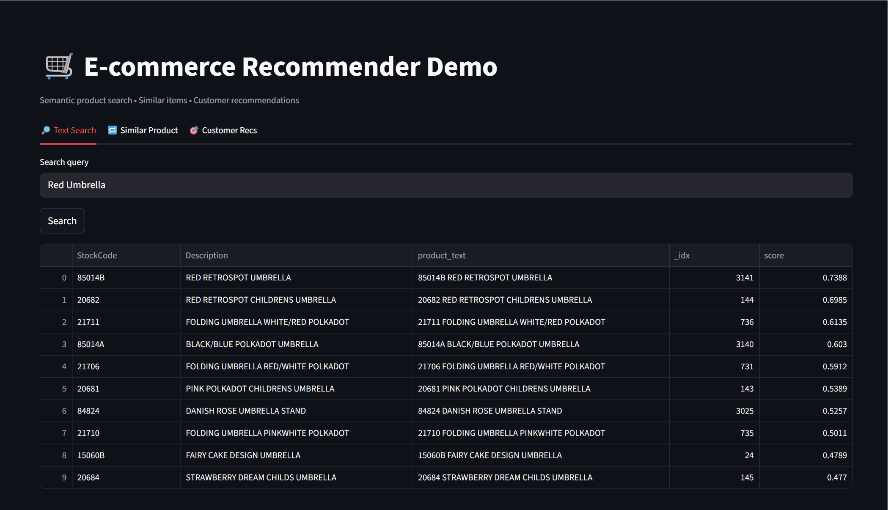
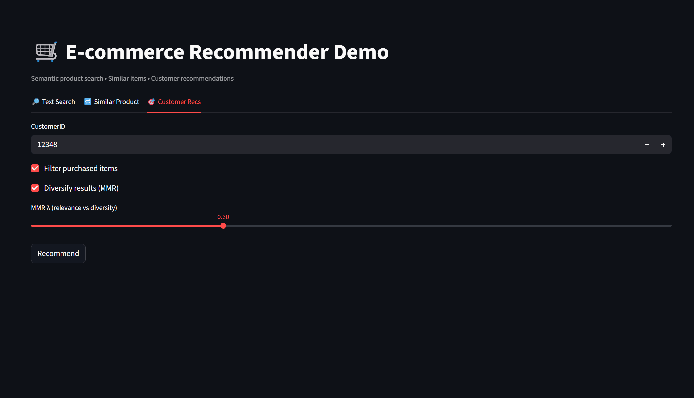
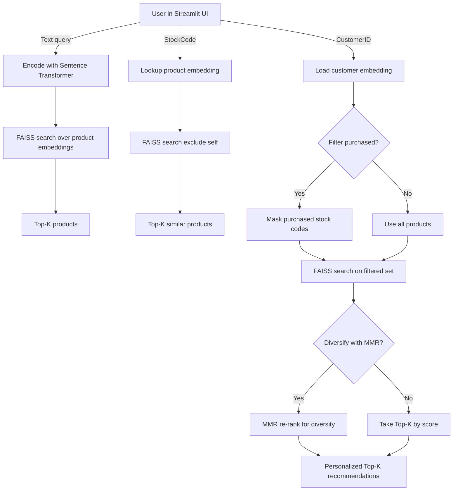
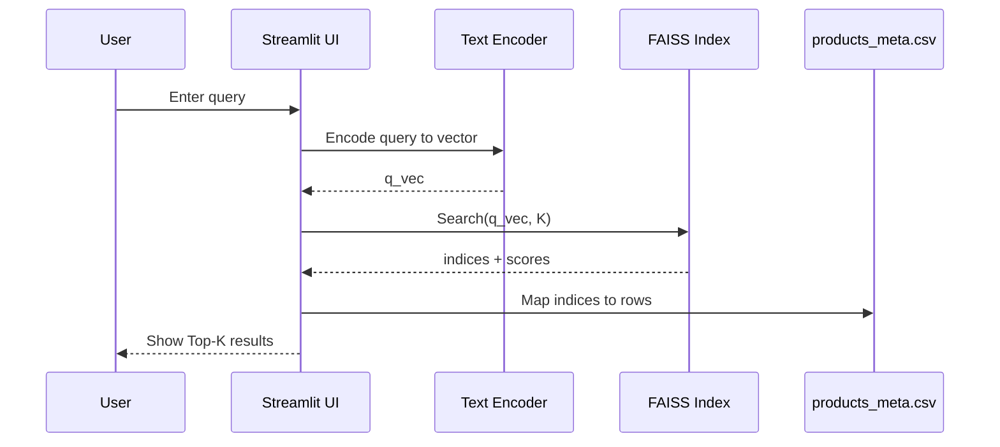
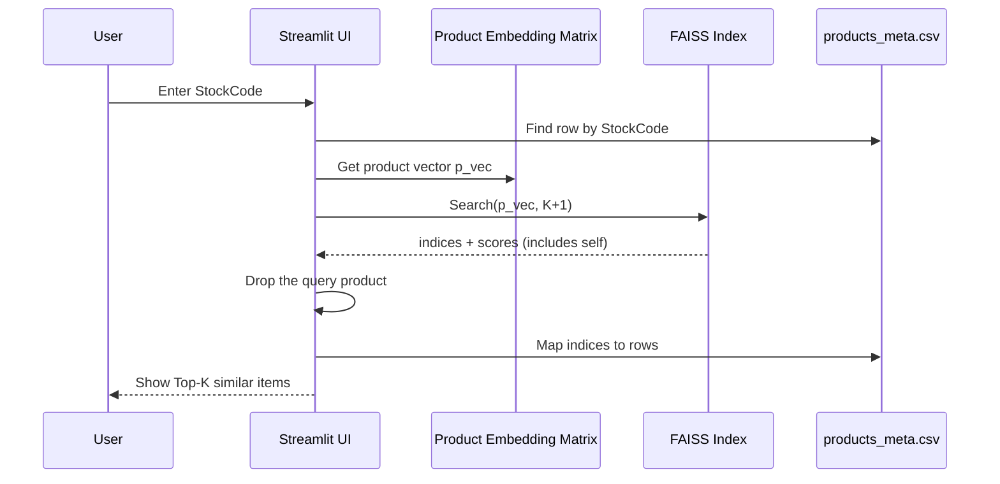
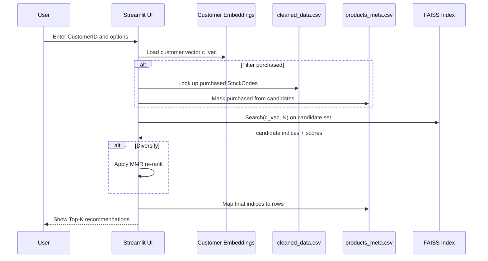

# 🛒 E-commerce Recommendation Engine
---
An end-to-end recommendation system for invoice-based e-commerce data, built with Python, FAISS, Sentence Transformers, and Streamlit.
## Description
This project was designed to mirror production-style considerations in building a recommender system: we began by cleaning raw invoice data to ensure reliability, then generated semantic embeddings with Sentence Transformers to capture product meaning beyond keywords, and indexed them with FAISS for fast, scalable retrieval. To make customer profiles realistic, we weighted purchase histories using log-scaled quantity to prevent bulk orders from dominating, recency decay to emphasize recent behavior, and inverse popularity to highlight niche preferences. For recommendations, we added options to filter out already purchased items and applied Maximal Marginal Relevance (MMR) to balance relevance with diversity, ensuring users don’t only see near-duplicate products (e.g., multiple t-shirts from the same brand). Finally, we built a simple Streamlit UI that demonstrates these core functionalities in an interactive way.

## Features
- **Data pipeline** → Cleans raw transactions into structured format  
- **Embeddings** → Semantic vectors for products & customers with Sentence Transformers  
- **Vector search** → FAISS index for fast similarity & product recommendations  
- **Advanced weighting** → Combines log-scaled quantity, recency decay, and inverse popularity for accurate recommendations  
- **Demo UI** → Interactive Streamlit app (text search, similar items, customer recs)  

---

## Project Structure
```text
data/                 # raw & cleaned CSVs
artifacts/            # generated embeddings & metadata
cleandata.py          # data cleaning pipeline
embed_products.py     # product embeddings
embed_customers.py    # customer embeddings
rag_search.py         # search + recommendation logic
app.py                # Streamlit demo UI
Makefile              # one-command pipeline 
requirements.txt      # UI + pipeline deps
```

---

## 🚀 Quickstart

### 1. Setup
```bash
python -m venv .venv
source .venv/bin/activate     # Linux/macOS/WSL
.venv\Scripts\activate        # Windows PowerShell

pip install -r requirements.txt
```

### 2. Run pipeline

**Linux/macOS/WSL**
```bash
make pipeline
```

**Windows (manual)**
```powershell
python cleandata.py --input data/data.csv --output data/cleaned_data.csv
python embed_products.py --input data/cleaned_data.csv --meta-out artifacts/products_meta.csv --emb-out artifacts/product_embeddings.npy
python embed_customers.py --cleaned data/cleaned_data.csv --products-meta artifacts/products_meta.csv --product-emb artifacts/product_embeddings.npy --customers-meta-out artifacts/customers_meta.csv --customer-emb-out artifacts/customer_embeddings.npy
```

### 3. Launch demo UI
```bash
streamlit run app.py
```

Open [http://localhost:8501](http://localhost:8501) to try:

- **Text search** → type queries like *“Party Balloons”*  
- **Similar items** → enter a product `StockCode`  
- **Customer recs** → enter a `CustomerID`, toggle *filter purchased* / *diversify*  

---

## 🎥 Demo

### Text Search


### Similar Products


### Customer Recommendations


---
# How the UI Tabs Work

## 1) Text Search (semantic search over products)
**Pipeline**
1. User enters a query (e.g., "Red Umbrella").
2. The app encodes the text with the same Sentence Transformer used for products.
3. We search the FAISS index.
4. Top-K product rows are returned with similarity scores.

---

## 2) Similar Products (more-like-this by StockCode)
**Pipeline**
1. User enters a `StockCode`.
2. We grab that product's vector from the product embedding matrix.
3. Run nearest-neighbor search in FAISS against all other products.
4. Return Top-K most similar items (excluding the product itself).

---

## 3) Customer Recs (personalized recommendations)
**Pipeline**
1. User enters a `CustomerID`.
2. We fetch the customer's embedding (weighted average of purchased product vectors: log-quantity, recency decay, inverse-popularity).
3. Candidate pool = all products (optionally filter out already purchased items).
4. Retrieve Top-N with FAISS, then optionally diversify with MMR (Maximal Marginal Relevance) to avoid near-duplicates.
5. Return Top-K recommended items.

---

## Flow Diagram (high level)



---

## Sequence Diagrams

### Text Search


### Similar Products


### Customer Recommendations


